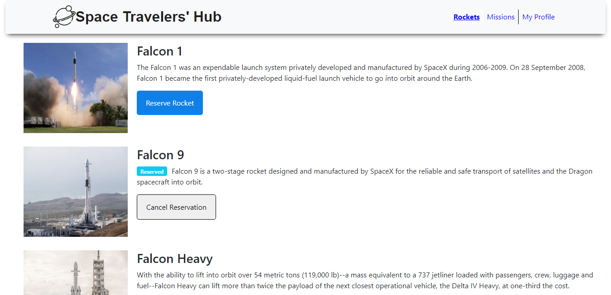

# Space Travelers' Hub

> The Space Travelers' Hub consists of Rockets, Missions, and the My Profile section.
Will working with the real live data from the SpaceX API. To build a web application for a company that provides commercial and scientific space travel services. The application will allow users to book rockets and join selected space missions.

## Built With

- Html
- Css
- JavaScript
- React
- Redux
- API
- React Bootstrap

## Live Demo

[Live Demo Link](https://spacetravelershub22.netlify.app/)

## Getting Started
To get a local copy up and running follow these simple example steps.

- Click on the top right green "code" button.
- On the dropdown menu, choose "download with zip" button.
- After download, extract the zip file and you have the project on your machine.
- After downloading run `npm i` to install all Node packages.
- Run `npm start` to run the project.

## Author

👤 **Luis Abarca**

- GitHub: [@TheLuisAbarca](https://github.com/TheLuisAbarca)

👤 **Kerolous Samy**

- GitHub: [@kerolous](https://github.com/keroloussamy)
- Twitter: [@kerolous](https://twitter.com/SamyKerolous)
- LinkedIn: [kerolous](https://www.linkedin.com/in/keroloussamy/)

## 🤝 Contributing

Contributions, issues, and feature requests are welcome!

Feel free to check the [issues page](../../issues/).

## Show your support

Give a ⭐️ if you like this project!

## 📝 License

This project is [MIT](./MIT.md) licensed.
